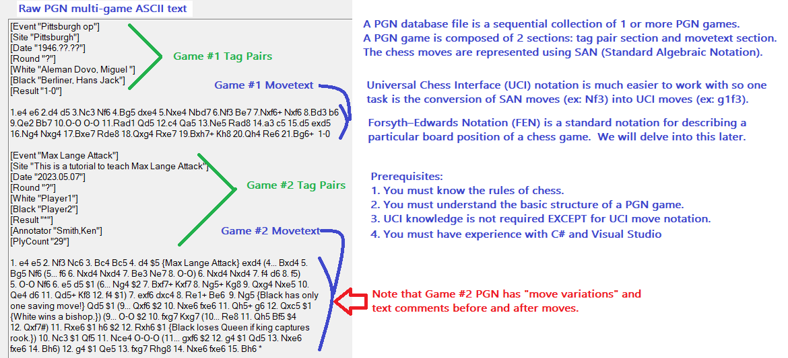
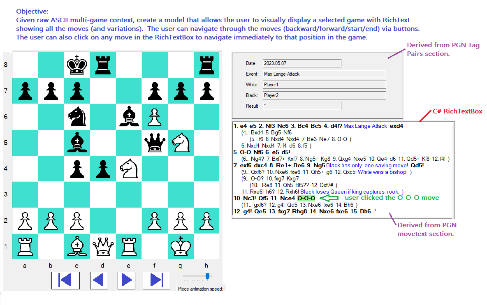

# KenChessPGNSolutions
**Two objectives:**
1. Tutorial for designing a PGN Chess Player
2. Library for myself for a future planned project, "Ken Chess Trainer".

**Clarify what this doesn't do!**
1. It does not play a game against the computer.
2. Currently, it does not allow you to create a PGN game.
## Current  Functionality
- **Tutorial** Provides a good tutorial for creating a C# application (with a GUI chess board) to navigate through a PGN game.
- **Reusable Components** There are several useful utility classes:
    - UtilitiesLegalUCIMoves: get all legal moves for active player
    - UtilitiesConvertPgnSANtoUCI: convert moves to Universal Chess Interface notation
    - StructuredPGNGame: Powerful C# Class object easily created from raw PGN ASCII multi-game text (and a specific game number).
- **Shown below are the first two pages of the Design Tutorial (see wiki for all pages)**

